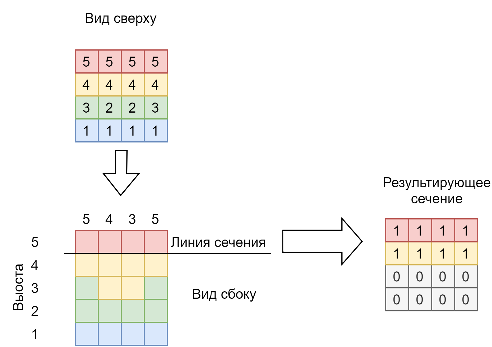

# Задание 14.6.7. Почти «Майнкрафт» (дополнительное задание)*
>Нам предстоит сделать некое подобие «Майнкрафта». <br>
>Миллионов не обещаю, но это интересная задача на пространственное мышление. <br>
>У нас есть небольшой квадратный ландшафт, размером 5 × 5 секторов. В каждом секторе располагается блок (столбик) ландшафта, максимальная высота которого — 10 блоков. <br>
>Текущая высота каждого такого блока задаётся пользователем в начале программы. <br>
>Итоговая задача: используя трёхмерный массив, вывести в стандартный вывод горизонтальное сечение (или горизонтальный срез) нашего небольшого мира. <br>
>Сам мир как раз должен быть представлен в виде трёхмерного массива. <br>
>Его горизонтальный срез — это двумерный массив, который надо отобразить в виде единиц и нулей. `0` — это отсутствие элемента на данном уровне в данной точке, `1` — элемент есть. <br>
>Уровень среза от 0 до 9 включительно также задаётся в стандартном вводе.

Пример выполнения
```C++
input matrix of heights:
  5 5 5 5
  4 4 4 4
  3 2 2 3
  1 1 1 1
input slice: 4
  1 1 1 1
  1 1 1 1
  0 0 0 0
  0 0 0 0
input slice: 3
  1 1 1 1
  1 1 1 1
  1 0 0 1
  0 0 0 0
```
`Пояснение к примеру`


`Что оценивается`

* Использован трёхмерный массив.
* Пользователь задаёт срез ландшафта, который хочет увидеть (от 0 до 9).
* Выводится срез размером 5 × 5, состоящий из 0 и 1.

`Советы и рекомендации`

При печати потребуется проверять содержимое трёхмерного массива. При уже известном значении уровня level проверка выглядит так:
```C++
if (world[i][j][level]) { 
//печатаем 1 

} else { 
//печатаем 0 

}
```
