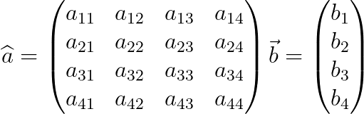
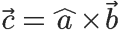
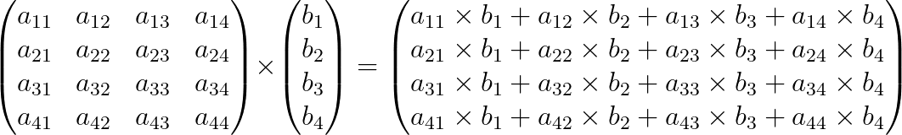

# Задание 14.6.4. Умножение матрицы на вектор

>Реализуйте частный случай умножения матрицы на матрицу, а именно умножение вектора на матрицу.  
>Эта операция распространена в компьютерной индустрии в целом и в компьютерной графике в частности, поэтому это будет хорошим упражнением.   
>Итак, у нас есть четырёхкомпонентный вектор `b`, представленный с помощью массива, и матрица a размером `4 × 4`, представленная 
>в виде двумерного массива.    
>Их произведением будет новый четырёхэлементный вектор c. Его компоненты будут суммой произведений элемента вектора `b` на строку матрицы `a`.    
>Индекс столбца при этом равен индексу соответствующей компоненты вектора `b`, который мы и рассчитываем.   
>Все входные данные, матрица `a` и вектор `b` вносятся из пользовательского ввода.  
>Итоговый вектор c надо вывести в консоль `(std::cout)`.    
>Тип данных элементов — всегда `float`.    
>Желательно реализовать этот алгоритм с помощью вложенного цикла на умножение колонки.

`Советы и рекомендации`

* Во внутреннем цикле потребуется аккумулятор, накапливающий значение очередной ячейки результирующего вектора. 
* Каждый раз не забывайте его обнулять до начала расчётов.

`Что оценивается`

Программа вычисляет результирующий вектор в соответствии с формулой перемножения матрицы на вектор.